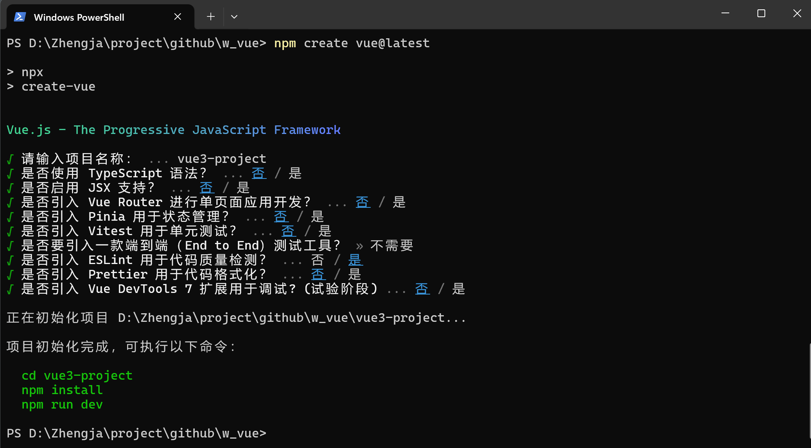

# vue-project

This template should help get you started developing with Vue 3 in Vite.

## Recommended IDE Setup

[VSCode](https://code.visualstudio.com/) + [Volar](https://marketplace.visualstudio.com/items?itemName=Vue.volar) (and
disable Vetur).

## Customize configuration

See [Vite Configuration Reference](https://vite.dev/config/).

## 使用 Vue 3 + Vite 快速搭建项目



```shell
# 快速搭建项目
npm create vue@latest
# 项目初始化完成，可执行以下命令：
cd vue-project
npm install
npm run dev
```

## Project Setup

```sh
npm install
```

### Compile and Hot-Reload for Development

```sh
npm run dev
```

### Compile and Minify for Production

```sh
npm run build
```

### Lint with [ESLint](https://eslint.org/)

```sh
npm run lint
```

## 本项目依赖组件：

```
npm install element-plus
npm install axios
```

## 组引入两种方式

以 element-plus 为例

```shell
   npm install element-plus
   
```

方法一：全局注册 Element Plus 组件

在 main.js 或 main.ts 中全局注册 Element Plus：

```javascript
   // src/main.js 或 main.ts
import {createApp} from 'vue';
import App from './App.vue';
import ElementPlus from 'element-plus';
import 'element-plus/dist/index.css';

const app = createApp(App);
app.use(ElementPlus);
app.mount('#app');

```

方法二：按需引入 Element Plus 组件

如果你不想全局注册所有 Element Plus 组件，可以选择按需引入。

在 Users.vue 文件的 <script> 标签中按需引入所需的 Element Plus 组件。

```vue
   <!-- src/components/UsersComponent.vue -->
<template>
  <div>
    <el-button type="primary" @click="userDialog = true">添加用户</el-button>
    <el-table :data="users" style="width: 100%">
      <el-table-column prop="username" label="用户名" width="180"></el-table-column>
      <el-table-column prop="email" label="邮箱" width="180"></el-table-column>
      <el-table-column label="操作">
        <template #default="scope">
          <el-button size="small" type="danger" @click="deleteUser(scope.row.id)">删除</el-button>
        </template>
      </el-table-column>
    </el-table>

    <!-- 添加用户对话框 -->
    <el-dialog title="添加用户" v-model="userDialog" width="30%">
      <el-form :model="newUser" label-width="80px">
        <el-form-item label="用户名">
          <el-input v-model="newUser.username"></el-input>
        </el-form-item>
        <el-form-item label="邮箱">
          <el-input v-model="newUser.email"></el-input>
        </el-form-item>
        <el-form-item label="密码">
          <el-input v-model="newUser.password" type="password"></el-input>
        </el-form-item>
      </el-form>
      <template #footer>
           <span class="dialog-footer">
             <el-button @click="userDialog = false">取消</el-button>
             <el-button type="primary" @click="addUser">确定</el-button>
           </span>
      </template>
    </el-dialog>
  </div>
</template>

<script>
  import {ref, onMounted} from 'vue';
  import axios from 'axios';
  import {ElMessage, ElButton, ElTable, ElTableColumn, ElDialog, ElForm, ElFormItem, ElInput} from 'element-plus';

  export default {
    components: {
      ElButton,
      ElTable,
      ElTableColumn,
      ElDialog,
      ElForm,
      ElFormItem,
      ElInput,
    },
    setup() {
      const users = ref([]);
      const userDialog = ref(false);
      const newUser = ref({
        username: '',
        email: '',
        password: '',
      });

      const fetchUsers = async () => {
        try {
          const response = await axios.get('http://127.0.0.1:8000/api/users/');
          console.log('Fetched users:', response.data); // 调试信息
          users.value = response.data;
        } catch (error) {
          ElMessage.error('获取用户列表失败');
          console.error('Error fetching users:', error); // 调试信息
        }
      };

      const addUser = async () => {
        try {
          const response = await axios.post('http://127.0.0.1:8000/api/users/', newUser.value);
          ElMessage.success('用户添加成功');
          users.value.push(response.data);
          userDialog.value = false;
          newUser.value = {
            username: '',
            email: '',
            password: '',
          };
        } catch (error) {
          ElMessage.error('用户添加失败');
          console.error('Error adding user:', error); // 调试信息
        }
      };

      const deleteUser = async (userId) => {
        try {
          await axios.delete(`http://127.0.0.1:8000/api/users/${userId}`);
          ElMessage.success('用户删除成功');
          users.value = users.value.filter(user => user.id !== userId);
        } catch (error) {
          ElMessage.error('用户删除失败');
          console.error('Error deleting user:', error); // 调试信息
        }
      };

      onMounted(() => {
        fetchUsers();
      });

      return {
        users,
        userDialog,
        newUser,
        addUser,
        deleteUser,
      };
    },
  };
</script>

<style scoped>
  .el-form-item {
    margin-bottom: 20px;
  }
</style>
   
```