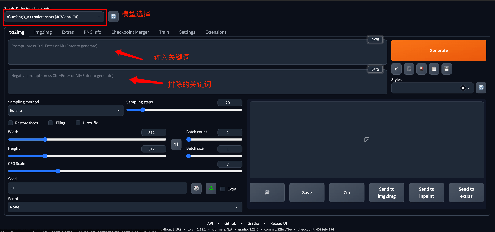
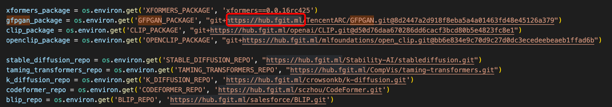

# Python AI 绘画

学习地址：[python-ai-draw.html](https://www.runoob.com/python3/python-ai-draw.html)

基于一些开源的库来搭建一套自己的 AI 作图工具。

需要使用的开源库为 Stable Diffusion web UI，它是基于 Gradio 库的 Stable Diffusion 浏览器界面

Stable Diffusion web UI GitHub 地址：https://github.com/AUTOMATIC1111/stable-diffusion-webui

运行 Stable Diffusion 需要硬件要求比较高，运行时会消耗较大的资源，特别是显卡。

## Windows 环境安装

本地环境要求安装 Python 3.10.6 或以上版本，并把它加入到本机的环境变量中。

### 下载 Stable Diffusion web UI GitHub 源码：

```shell

git clone https://github.com/AUTOMATIC1111/stable-diffusion-webui.git

# or 
# 如果没有安装 Git ，可以在右上角下载 zip 压缩包。
```

### 下载模型

* 访问：https://huggingface.co/CompVis/stable-diffusion-v-1-4-original
    * 选择下载：[sd-v1-4.ckpt](https://huggingface.co/CompVis/stable-diffusion-v-1-4-original/resolve/main/sd-v1-4.ckpt)

将下载的模型移动到 stable-diffusion-webui/models/Stable-diffusion 目录下。

### 启动

Windows 使用非管理员运行:

```shell
webui-user.bat
```

访问：
http://127.0.0.1:7860

示例：


注意: 如果安装出现卡住不动，很可能是下载 Github 源码出现问题了，可以使用 Github 的一些镜像来解决，目前还没非常稳定的镜像，建议
Google 搜索下。 我这边在 2023 年 4 月 6 号使用以下镜像地址 https://hub.fgit.ml，打开 stable-diffusion-webui 目录的
launch.py 文件，替换以下部分代码的 Github 地址（代码大概在 230～240 行之间）：


## Civitai 介绍

Civitai 有许多定制好的模型，而且可以免费下载，我们使用国风3模型来测试

国风3模型下载地址：https://civitai.com/models/10415/3-guofeng3?modelVersionId=36644

将下载的模型移动到 stable-diffusion-webui/models/Stable-diffusion 目录下。

重新启动 stable-diffusion-webui

```shell
webui-user.bat
```
